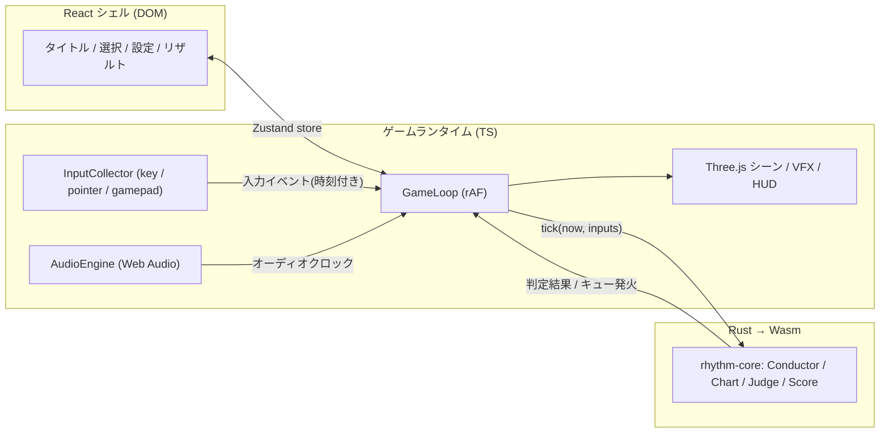

# 3D リズムゲーム — 超大枠計画・技術選定

リズム天国ライクな「コール＆レスポンス型」3D リズムゲームをブラウザで動かす。
本ドキュメントはプロジェクトの最上位計画。実装が進んだら各節を個別ドキュメントに分割していく。

- ステータス: **v0 ドラフト（技術選定フェーズ）**
- 最終更新: 2026-07-19

---

## 1. ゲームコンセプト

「リズム天国ライク」を要素分解すると、設計に効くのは次の 4 点:

| 特徴 | 設計への含意 |
|---|---|
| 入力は 1〜2 ボタンの単純な「動詞」 | 入力系は極小。複雑さは譜面と演出に寄せる |
| 音のキュー（予告）→ レスポンス（入力）の文法 | 「キュー表＝譜面」を中心に据えたデータ駆動設計 |
| 判定は音基準でシビア（見た目より耳） | **オーディオクロックを唯一の正とするタイミング設計が最重要** |
| ミニゲームの集合体（＋リミックス） | ミニゲーム単位で差し替え可能なフレームワーク化 |

3D（Three.js）は演出面の強み: 物が飛んでくる・カメラが振れる・奥行きのあるステージなど、
「1 ボタンでも画面が豪華」を狙う。ゲーム性自体は 2D のリズム天国と同じ文法を踏襲する。

想定プレイ環境（初期）: **PC ブラウザ + キーボード、有線/内蔵スピーカー推奨**。
モバイル（タッチ）は M4 で対応検討。

---

## 2. 技術選定サマリ

| 領域 | 採用 | 主な対抗馬 | 一言理由 |
|---|---|---|---|
| レンダリング | **Three.js (WebGL2)** | Babylon.js / Bevy(Wasm) / PlayCanvas | 指定。軽量・情報量・自由度のバランス |
| 言語 | **TypeScript (strict)** | — | 型安全は譜面/判定まわりで特に効く |
| ビルド | **Vite** | — | 指定。Wasm 資産の取り回しも素直 |
| ロジックコア | **Rust → Wasm (wasm-bindgen + wasm-pack)** | AssemblyScript / 全部 TS | 指定。判定・タイムライン・譜面コンパイルを担当 |
| UI | **React 19（ゲーム外シェルのみ）** | Solid / Svelte / 素 DOM | フレームループに React を入れなければ性能問題なし |
| 状態橋渡し | **Zustand (vanilla store + React バインド)** | Jotai / Redux | ゲームループ側から非 React で書き込める |
| オーディオ | **Web Audio API 直** | Howler.js / Tone.js | クロック・先行スケジューリングを完全制御したい |
| 3D テキスト/HUD | **troika-three-text + 命令的 DOM 更新** | CSS2DRenderer | SDF で綺麗、React 再レンダを踏まない |
| ポストプロセス | **pmndrs/postprocessing** | three 標準 EffectComposer | パス統合が効率的 |
| Lint/Format | **Biome** | ESLint + Prettier | 一本化・高速（Rust 製で思想も揃う） |
| テスト | **cargo test（コア）+ Vitest（グルー）+ Playwright（スモーク）** | — | 判定ロジックは Rust 側で決定論テスト |
| パッケージ管理 | **pnpm** / cargo workspace | npm / yarn | モノレポ化しても破綻しない |
| CI | **GitHub Actions** | — | rust(test/clippy) + web(typecheck/build) |
| ホスティング | **GitHub Pages（当面）** | Cloudflare Pages | 静的で足りる。SAB が要る日が来たら CF Pages へ（後述） |

### 2.1 レンダリング: Three.js を「素で」使う（react-three-fiber は不採用）

- リズムゲームはフレームとオーディオクロックの対応を**命令的に**握りたい。R3F の宣言的シーングラフ＋リコンサイラは、メニュー画面には快適でもゲーム本体には間接層になる。
- シーンは plain Three.js + 自前ゲームループ（rAF）で構築。React はこのループに一切関与しない。
- WebGPURenderer は現状見送り（対応環境・安定性）。WebGL2 で十分な絵作りが可能。移行余地はレンダラ層の抽象で確保。

### 2.2 UI: React はゲーム外シェル限定

- React の担当: タイトル / ミニゲーム選択 / 設定・キャリブレーション画面 / リザルト / ポーズメニュー。すべて「毎フレーム更新されない」画面。
- ゲーム中 HUD（コンボ数・判定ポップ）は three シーン内（troika-text / スプライト）または `ref.textContent` 直更新の DOM。**フレームループ内で React の再レンダを発生させない**のが唯一のルール。
- この規律を守る限り React で性能上の不利はない。エコシステムと開発速度で採用。（それでも気になるなら Solid だが、置き換えコストに見合うゲインがない）

### 2.3 Rust/Wasm の担当範囲 — 「決定論コア」だけを Rust にする

Wasm 化して得をする処理・しない処理を最初に線引きする:

**Rust に置く（決定論・計算・データ）**
- Conductor: BPM マップ（変拍子・BPM 変化・停止）に基づく beat ⇄ 秒 変換
- 譜面のパース・検証・「秒に展開済みイベント列」へのコンパイル
- 判定エンジン: 入力時刻 vs 期待時刻 → ぴったり/セーフ/ミス、コンボ、スコア、リザルト集計
- リプレイ（入力ログ再生 = 同一結果になる決定論性）
- 将来: 譜面制作支援のオンセット検出などの DSP（rustfft）

**TS/JS に置く（I/O・演出）**
- Web Audio の再生・先行スケジューリング（※スケジューリング自体はブラウザがサンプル精度でやる。Wasm にしても速くならない）
- 入力イベント収集、Three.js シーン、VFX、UI

ポイント: **コアクレートは wasm 非依存の純 Rust** にして `cargo test` で判定・変換を網羅テストする。wasm-bindgen バインディングは薄い別クレート。

### 2.4 Wasm ビルド: wasm-pack `--target web`（Vite プラグイン不要）

- `wasm-pack build --target web` の生成物（ESM グルー + `_bg.wasm`）は、グルー内の `new URL('..._bg.wasm', import.meta.url)` を Vite がそのまま資産として解決するため、**プラグインなしで dev / build / worker すべて動く**。
- `vite-plugin-wasm`（`--target bundler` 用）は不採用。依存を増やさない。
- 開発時は `cargo watch -s "wasm-pack build ..."` で再ビルド → Vite が変更検知してリロード。

---

## 3. アーキテクチャ大枠



レイヤー原則:

1. **Core (Rust)** — 純ロジック。I/O・時計・乱数を持たない（すべて引数で受ける）。→ 決定論・テスト容易・リプレイ可能
2. **Runtime (TS)** — 時計と I/O の現実を Core の抽象に変換する層。Audio/Input/Loop
3. **Presentation (Three.js)** — Core が出すイベントを消費して演出するだけ。ゲーム状態を持たない
4. **Shell (React)** — 画面遷移と設定。ゲームループとは Zustand 経由で疎結合

### 3.1 タイミング設計（本プロジェクトの心臓部）

**原則: マスタークロックは `AudioContext.currentTime`。`performance.now()` / rAF 時刻は描画専用。**

- 曲位置: `songPos = ctx.currentTime - songStartAt + chartOffset`
- キュー音・メトロノーム等は `AudioBufferSourceNode.start(when)` で 100〜200ms 先行予約 → **サンプル精度**で鳴る（lookahead スケジューラ）
- 入力: `keydown` / `pointerdown` の `event.timeStamp`（performance 系時刻）を、毎フレーム更新する performance ⇄ audio クロック対応表（`getOutputTimestamp()` ベース + 平滑化）でオーディオ時刻に変換してから判定
- 描画: rAF ごとにオーディオクロックから曲位置を読み、補間して描画（描画がもたついても判定はズレない）
- ポーズ: `ctx.suspend()/resume()` + `visibilitychange`（裏タブの rAF 停止対策）

**キャリブレーション（設定画面に常設）**
- **入力オフセット**（判定用）と**映像オフセット**(表示用) を別々に測定・保存（localStorage）
- 初期値は `ctx.baseLatency + outputLatency` から推定
- Bluetooth ヘッドホン（+150〜300ms）は音のキュー自体が遅れて聞こえるため補正しきれない → 検出して警告表示（リズム天国系は音が命なので有線推奨を明示）

判定ウィンドウ（初期値・ミニゲームごとに調整可能）:

```
        ミス      セーフ    ぴったり    セーフ      ミス
  ────────────┼─────────┼────╂────┼─────────┼────────────→ 時間
           -100ms     -45ms   0   +45ms     +100ms
                           (期待時刻)
```

- 判定は「フレーム到達時」ではなく**入力時刻とウィンドウの数値比較**で行う（60fps 粒度に依存しない）
- リザルトランクはリズム天国風: やりなおし / 平凡 / ハイレベル（+ ノーミスでパーフェクト勲章）

### 3.2 Wasm 境界設計（チャットせず、バッチする）

境界越えのコストは「呼び出し回数 × データ変換」で決まる。設計ルール:

- **1 フレーム 1 回** `engine.tick(audioNow, inputs)` を呼ぶだけ。inputs は小さな Float64Array（時刻 + ボタン ID）
- 戻りは「このフレームで起きたこと」（判定結果、スポーンすべきキュー、スコア差分）を**フラットな TypedArray / 共有メモリビュー**で受け、TS 側で enum 引きする
- serde（JSON デシリアライズ）は**譜面ロード時のみ**。フレームループでは一切使わない
- 目標: wasm バイナリ < 300KB（wasm-opt 込み）、tick 呼び出し < 0.5ms

### 3.3 ミニゲームフレームワーク（M3 で確立）

ミニゲーム = **「3D シーン（演出）+ キュー表（譜面）+ 入力動詞（1〜2 個）」** の 3 点セット。

- 共通基盤: Conductor / CueScheduler / JudgeEngine（Rust）、FeedbackSystem（ヒット時 VFX・SFX）、ResultCollector
- 各ミニゲームが実装するのは「キュー種別 → 演出」のマッピングと固有アセットのみ
- リズム天国の流儀に倣い、**各ミニゲームに練習モード**（案内つきループ）を組み込む

---

## 4. 譜面フォーマット v0

JSON（人力編集 + git diff 可能）。Rust 側でパース・検証し、秒に展開済みのイベント列へコンパイルする。

```jsonc
{
  "meta": { "id": "karate-01", "title": "カラテ家", "audio": "karate.ogg", "offsetSec": 0.032 },
  "timing": { "bpm": [ { "beat": 0, "bpm": 120 } ] },   // BPM変化は配列追加で表現
  "cues": [
    { "beat": 4.0, "type": "cue:throw",  "params": { "obj": "pot" } },  // 予告(音+モーション)
    { "beat": 6.0, "type": "hit",        "window": "default" }          // 入力期待点
  ]
}
```

- 制作フローは当面「手書き JSON + Vite ホットリロード」。M4 以降に「曲を流してタップで置く」記録モードを検討
- 音源フォーマット: ogg/opus 主 + m4a(AAC) フォールバック（`decodeAudioData` の互換性対策）

---

## 5. リポジトリ構成案

単一パッケージで開始（pnpm workspace 化はツール類が増えてから）:

```
threejs-claude/
├─ crates/
│  ├─ rhythm-core/      # 純ロジック (wasm非依存・cargo testの主戦場)
│  └─ rhythm-wasm/      # wasm-bindgen の薄いバインディング → pkg/ を生成
├─ src/
│  ├─ audio/            # AudioEngine, lookaheadスケジューラ, クロック橋, キャリブレーション
│  ├─ input/            # key/pointer/gamepad 収集(時刻付きイベント化)
│  ├─ game/             # GameLoop, ミニゲームFW, wasmローダ
│  ├─ three/            # レンダラ, シーン, VFX, アセットロード
│  └─ ui/               # React シェル (タイトル/選択/設定/リザルト) + Zustand store
├─ charts/              # 譜面 JSON
├─ public/assets/       # 音源, glTF(KTX2/Draco圧縮), フォント
├─ docs/                # 本ドキュメント群
└─ .github/workflows/   # CI: rust(fmt/clippy/test) + web(typecheck/biome/vitest/build)
```

---

## 6. マイルストーン

原則: **最大リスク（タイミング精度）から潰す**。絵作りは後。

### M0 — タイミング検証スパイク（最重要・最初の 1 本）
「メトロノームの縦切り」。Vite + TS + Three.js の空シーン、Rust→Wasm の判定関数、Web Audio クロック、入力パイプを最小構成で貫通させる。
- **Done 条件**: クリック音に合わせてキーを叩くと ±ms の誤差が表示され、有線環境で誤差分布が安定（目安 σ < 10ms）。wasm がプラグインなしで dev/build 両方動く

### M1 — コアエンジン
Rust: Conductor（BPM 変化対応）/ 譜面パーサ / 判定 / スコア / リプレイ。TS: 譜面ローダ、キャリブレーション画面、デバッグ HUD（誤差・fps・tick 時間）。
- **Done 条件**: `cargo test` で判定・変換が網羅され、同一入力ログ → 同一リザルトの決定論が成立

### M2 — ミニゲーム 1 本の縦切り（品質基準を作る）
1 ボタンゲーム 1 本（例: 飛んでくる物を打ち返す「カラテ家」型 — 3D 演出が映える）。キュー音・ヒット VFX/SFX・リザルト・ランクまで通す。**ここで「気持ちよさ」を徹底チューニングし、以後の品質基準にする**
- **Done 条件**: 第三者が遊んで「音ゲーとして成立している」と言える。判定に理不尽がない

### M3 — フレームワーク化 + ゲームシェル
M2 の実装からミニゲーム共通インターフェースを抽出。React シェル（タイトル/選択/設定/リザルト）、ポーズ、練習モード、永続化（校正値・ハイスコア）、アセットパイプライン整備。
- **Done 条件**: 新規ミニゲームの追加が「シーン + 譜面 + 動詞マッピング」の追加だけで済む

### M4 — コンテンツ & 磨き
ミニゲーム 2〜3 本目、（余力で）リミックス、ポストプロセス演出、モバイルタッチ対応検討、パフォーマンス最適化、GitHub Pages デプロイ。

---

## 7. パフォーマンス予算（60fps = 16.6ms/フレーム）

| 項目 | 予算 |
|---|---|
| JS ロジック + Wasm tick | < 2.5ms（うち tick < 0.5ms） |
| 描画（draw call） | < 100 calls / < 30 万 tris |
| フレームループ内のヒープ割り当て | **ゼロ**（オブジェクトプール、TypedArray 再利用） |
| wasm バイナリ | < 300KB (gz) |
| 初期ロード（音源除く） | < 5MB (gz) |

- 120Hz モニタ対応のため、ロジックは rAF 回数に依存させない（常にオーディオクロック基準）
- キューオブジェクトは InstancedMesh + プールで使い回す
- GC ヒッチ監視: デバッグ HUD にフレームタイム p99 を常時表示

---

## 8. リスクと対策

| リスク | 影響 | 対策 |
|---|---|---|
| 出力遅延の個体差（特に Bluetooth） | 判定が理不尽になる | キャリブレーション常設 + `outputLatency` からの初期推定 + BT 検出時警告 |
| 裏タブ・省電力による rAF 停止/間引き | 曲と画面の乖離 | クロックはオーディオ基準なので判定は無事。`visibilitychange` で自動ポーズ |
| iOS/Safari の AudioContext 制約（ジェスチャ必須等） | 起動不能・無音 | 「タップでスタート」ゲートで unlock、resume 監視。モバイル本対応は M4 |
| Wasm 境界がチャットになり性能劣化 | フレーム落ち | §3.2 の 1 フレーム 1 call + TypedArray 規約を最初から守る |
| GC ヒッチ | 判定は無事だが絵がカクつく | 割り当てゼロ規律 + プール + p99 監視 |
| 3D アセット制作コスト | 進捗停滞 | ローポリ・トゥーン + 単色マテリアルをアート方針に（リズム天国のシンプルさとも整合） |
| スコープ肥大（エディタ・オンライン等） | 完成しない | v1 は「ローカルで遊べるミニゲーム 3 本」に固定。エディタ/リミックスは余力枠 |

将来 SharedArrayBuffer（AudioWorklet との共有リングバッファ等）が必要になったら COOP/COEP ヘッダが必須になる。その時点で GitHub Pages → Cloudflare Pages（`_headers` 対応）へ移行する。**v1 では不要**（BufferSource の先行予約だけでサンプル精度が出るため）。

---

## 9. 未決事項（プロダクトオーナー確認したい）

1. **プラットフォーム優先度** — PC キーボード先行で進める想定。モバイル（タッチ）の重要度は?
2. **アート方針** — ローポリ・トゥーン（単色 + 輪郭 + シンプル背景）を仮置き。イメージに合う?
3. **音源の調達** — 自作 / フリー素材 / 発注? ライセンス方針も含めて
4. **v1 のミニゲーム本数目標** — 3 本 + （余力で）リミックス 1 本を仮置き
5. **オンライン要素** — v1 はなし（ローカル完結）想定で OK?

---

## 10. 次のアクション

1. 未決事項の回答をもらう（ブロッカーではない。デフォルト値で M0 は着手可能）
2. **M0 スパイクの実装開始**: Vite + TS + Three.js + wasm-pack の scaffolding → メトロノーム判定の貫通
3. CI（rust test + web build）を M0 と同時に立てる
