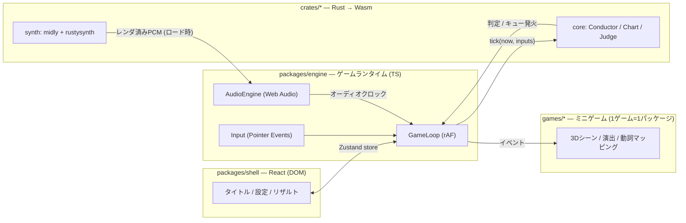

# 3D リズムゲーム — 超大枠計画・技術選定

リズム天国ライクな「コール＆レスポンス型」3D リズムゲームを**モバイルブラウザ専用**で動かす。
本ドキュメントはプロジェクトの最上位計画。実装が進んだら各節を個別ドキュメントに分割していく。

- ステータス: **v1.0 確定（技術選定・大枠計画フィックス、実装フェーズへ）**
- 最終更新: 2026-07-19

## 0. 決定ログ

| 日付       | 決定                                                                                                                                   |
| ---------- | -------------------------------------------------------------------------------------------------------------------------------------- |
| 2026-07-19 | **モバイル専用**。モバイルレイアウト前提（PC は開発用途のみ）                                                                          |
| 2026-07-19 | アートは**ローポリ・トゥーン**                                                                                                         |
| 2026-07-19 | 音源は **MIDI**。再生は自作シンセ or ライブラリ（調査結果 → §4、本命 rustysynth）                                                      |
| 2026-07-19 | **v1 はミニゲーム 1 本**。オンライン要素なし                                                                                           |
| 2026-07-19 | **モジュラモノリス**: ゲームごとに別モジュール、疎結合を構造で強制                                                                     |
| 2026-07-19 | **縦持ち固定**で確定（横持ち対応はしない）                                                                                             |
| 2026-07-19 | v1 ミニゲームは**「カラテや」**で確定（仕様概要 → §9）                                                                                 |
| 2026-07-19 | 音は一任 → **路線 A（SF2 サブセット、GeneralUser GS 第一候補）で確定**。自作音色（路線 B）は v2 オプション                             |
| 2026-07-19 | Lint は **Biome → oxlint**（+ oxfmt）に変更。ライブラリは**可能な限り最新版**を採用（TS7 / Vite8 / Vitest4 / three r185 / React 19.2） |

---

## 1. ゲームコンセプト

「リズム天国ライク」を要素分解すると、設計に効くのは次の 4 点:

| 特徴                                         | 設計への含意                                                       |
| -------------------------------------------- | ------------------------------------------------------------------ |
| 入力は 1〜2 個の単純な「動詞」               | モバイルと相性最良: 画面全体タップを主動詞に（+ホールド/フリック） |
| 音のキュー（予告）→ レスポンス（入力）の文法 | 「キュー表＝譜面」を中心に据えたデータ駆動設計                     |
| 判定は音基準でシビア（見た目より耳）         | **オーディオクロックを唯一の正とするタイミング設計が最重要**       |
| ミニゲームの集合体                           | ミニゲーム = 独立モジュール（モジュラモノリス）                    |

- プレイ環境: **スマホ縦持ち（9:16〜9:19.5）固定**、片手親指プレイを基本形に据える
- 3D の使い所: 奥行き方向から物が飛んでくる構図は縦画面と相性が良い。カメラワーク・ローポリトゥーンの「1 ボタンでも画面が豪華」を狙う
- v1 スコープ: **ミニゲーム 1 本「カラテや」**（仕様概要 → §9）+ タイトル/設定/リザルト

---

## 2. 技術選定サマリ

| 領域               | 採用                                                                    | 主な対抗馬               | 一言理由                                                         |
| ------------------ | ----------------------------------------------------------------------- | ------------------------ | ---------------------------------------------------------------- |
| 対象環境           | **iOS Safari / Android Chrome（モバイル専用・縦持ち）**                 | —                        | 決定事項                                                         |
| レンダリング       | **Three.js (WebGL2)**                                                   | Babylon.js / Bevy(Wasm)  | 指定。モバイル WebGL2 は成熟                                     |
| 言語               | **TypeScript (strict)**                                                 | —                        | 譜面/判定まわりで型が効く                                        |
| ビルド             | **Vite + pnpm workspace（モジュラモノリス）**                           | Turborepo                | 単一デプロイ・内部パッケージ分割                                 |
| ロジックコア       | **Rust → Wasm (wasm-bindgen + wasm-pack)**                              | 全部 TS                  | 判定・譜面・**シンセ**を担当                                     |
| 音源               | **MIDI + SoundFont、Rust シンセでレンダ（rustysynth + midly）**         | SpessaSynth / 自作 DSP   | §4 の調査結果。オーディオファイル同梱不要                        |
| オーディオ再生     | **Web Audio API 直**（レンダ済み AudioBuffer の先行予約再生）           | Howler / Tone.js         | クロック完全制御。ワークレット不要で開始                         |
| UI                 | **React 19（ゲーム外シェルのみ）**                                      | Solid / 素 DOM           | フレームループに React を入れない規律で十分                      |
| 状態橋渡し         | **Zustand (vanilla store + React バインド)**                            | Jotai                    | ループ側から非 React で書き込める                                |
| 入力               | **Pointer Events（タッチ）**                                            | Touch Events             | 統一 API・`event.timeStamp` で判定                               |
| 3D テキスト/HUD    | **troika-three-text + 命令的 DOM 更新**                                 | CSS2DRenderer            | React 再レンダを踏まない                                         |
| ポストプロセス     | **原則なし**（輪郭はインバーテッドハル等マテリアルで）                  | pmndrs/postprocessing    | モバイル GPU・熱・電池優先                                       |
| Lint/Format        | **oxlint + oxfmt**                                                      | Biome / ESLint+Prettier  | Rust 製で高速。当初 Biome だったが oxlint へ変更（決定ログ参照） |
| モジュール境界検査 | **package.json 依存宣言 + dependency-cruiser (CI)**                     | eslint-plugin-boundaries | 物理強制 + 自動検査の二段構え                                    |
| テスト             | **cargo test（コア）+ Vitest + Playwright（モバイルエミュレーション）** | —                        | 判定は Rust 側で決定論テスト                                     |
| 配布               | **GitHub Pages + PWA（manifest/SW, M3〜）**                             | Cloudflare Pages         | 静的で足りる。SAB が要る日が来たら CF へ                         |

### 2.1 レンダリング: Three.js を「素で」使う（react-three-fiber は不採用）

- リズムゲームはフレームとオーディオクロックの対応を**命令的に**握りたい。R3F のリコンサイラは間接層になるため不採用。
- シーンは plain Three.js + 自前ゲームループ（rAF）。React はこのループに一切関与しない。
- WebGPU は見送り（iOS Safari の成熟待ち）。WebGL2 で十分。

### 2.2 UI: React はゲーム外シェル限定

- React の担当: タイトル / 設定・キャリブレーション / リザルト / ポーズ。毎フレーム更新されない画面のみ。
- ゲーム中 HUD は three シーン内（troika-text / スプライト）または `ref.textContent` 直更新。**フレームループ内で React の再レンダを発生させない**のが唯一のルール。

### 2.3 Rust/Wasm の担当範囲

**Rust に置く（決定論・計算・データ）**

- Conductor: テンポマップに基づく beat ⇄ 秒 変換（テンポマップは MIDI 由来 → §4.3）
- MIDI パース（midly）と譜面コンパイル（キュートラック → 秒展開済みイベント列）
- **シンセ（rustysynth）: MIDI + SoundFont → PCM オフラインレンダ**
- 判定エンジン・コンボ・スコア・リザルト集計・リプレイ

**TS/JS に置く（I/O・演出）**

- Web Audio 再生・先行スケジューリング、入力収集、Three.js シーン、VFX、UI

コアクレートは wasm 非依存の純 Rust にして `cargo test` で網羅テスト。wasm-bindgen バインディングは薄い別クレート。

### 2.4 Wasm ビルド: wasm-pack `--target web`（Vite プラグイン不要）

- 生成物のグルー内 `new URL('..._bg.wasm', import.meta.url)` を Vite がそのまま資産解決するため、プラグインなしで dev / build / worker すべて動く。
- 開発時は `cargo watch -s "wasm-pack build ..."` → Vite が変更検知してリロード。

---

## 3. アーキテクチャ大枠



レイヤー原則:

1. **Core (Rust)** — 純ロジック。I/O・時計・乱数を持たない。→ 決定論・テスト容易・リプレイ可能
2. **Engine (TS)** — 時計と I/O の現実を Core の抽象に変換。Audio/Input/Loop と `Minigame` 契約の定義
3. **Game (TS)** — 契約の実装。演出とアセットだけを持ち、ゲーム状態を持たない
4. **Shell (React)** — 画面遷移と設定。Zustand 経由で疎結合

### 3.1 タイミング設計（心臓部）

**原則: マスタークロックは `AudioContext.currentTime`。`performance.now()` / rAF 時刻は描画専用。**

- 曲位置: `songPos = ctx.currentTime - songStartAt`（シンセレンダのため **sample 0 = 曲頭が定義上一致**。録音素材で必要だった曲ごとのオフセット測定が不要になる）
- 曲・キー音は `AudioBufferSourceNode.start(when)` で 100〜200ms 先行予約 → サンプル精度
- 入力: `pointerdown` の `event.timeStamp` を performance ⇄ audio クロック対応表（`getOutputTimestamp()` + 平滑化）でオーディオ時刻に変換してから判定
- 描画: rAF ごとにオーディオクロックから曲位置を読んで補間（描画がもたついても判定はズレない）
- ポーズ: `ctx.suspend()/resume()` + `visibilitychange`

**キャリブレーション（設定画面に常設）**

- **入力オフセット**（判定用）と**映像オフセット**（表示用）を別々に測定・保存（localStorage）
- 初期値は `baseLatency` / `outputLatency`（Android Chrome）から推定。iOS は実測校正に頼る
- Bluetooth イヤホン（+150〜300ms）は音キュー自体が遅れるため補正しきれない → 検出して警告

判定ウィンドウ（初期値・調整可能）:

```
        ミス      セーフ    ぴったり    セーフ      ミス
  ────────────┼─────────┼────╂────┼─────────┼────────────→ 時間
           -100ms     -45ms   0   +45ms     +100ms
```

- 判定は入力時刻とウィンドウの数値比較（フレームレート非依存）。モバイルのタッチサンプリング（60〜120Hz → ±4〜8ms の固有ジッタ）はウィンドウ幅に織り込み済み
- ランク: やりなおし / 平凡 / ハイレベル（+ ノーミスでパーフェクト勲章）

### 3.2 モバイル前提の実装項目

| 項目           | 方針                                                                                                                                                                  |
| -------------- | --------------------------------------------------------------------------------------------------------------------------------------------------------------------- |
| 画面           | 縦持ち固定デザイン。iOS はロック API 不可 → 横向き検出で「縦にしてね」オーバレイ。`dvh` / `safe-area-inset-*` 対応                                                    |
| タッチ         | `touch-action: none`、ピンチ/ダブルタップズーム抑止。主動詞は「画面のどこでもタップ」                                                                                 |
| iOS オーディオ | タップでスタート（AudioContext unlock）、電話/バックグラウンド中断からの resume 監視、**サイレントスイッチ対策（無音 `<audio>` ループでメディア再生カテゴリへ切替）** |
| 画面消灯       | Screen Wake Lock API でプレイ中の消灯防止                                                                                                                             |
| ハプティクス   | Android のみ `navigator.vibrate` でヒット時フィードバック（iOS Safari 不可・諦める）                                                                                  |
| デバッグ       | `vite --host` + 実機、Safari Web Inspector / chrome://inspect、画面内デバッグ HUD（誤差分布・fps・tick 時間）                                                         |
| PC             | 開発用にキーボード入力も engine に残す（プロダクト対象外）                                                                                                            |

### 3.3 Wasm 境界設計（チャットせず、バッチする）

- **1 フレーム 1 回** `engine.tick(audioNow, inputs)`。inputs は小さな Float64Array（時刻 + 動詞 ID）
- 戻りは「このフレームで起きたこと」（判定結果・スポーンすべきキュー・スコア差分）をフラットな TypedArray / 共有メモリビューで受ける
- serde は譜面ロード時のみ。フレームループでは使わない
- シンセは**ロード時のみ**動く（§4.2）。フレームループには存在しない

---

## 4. 音源パイプライン: MIDI + シンセ（調査結果と選定）

### 4.1 ライブラリ調査（2026-07 時点）

| 候補                                                            | 種別                                 | ライセンス | 所感                                                                                                                 |
| --------------------------------------------------------------- | ------------------------------------ | ---------- | -------------------------------------------------------------------------------------------------------------------- |
| **[rustysynth](https://github.com/sinshu/rustysynth)**          | Rust / SF2 シンセ（MeltySynth 移植） | MIT        | **本命**。依存ゼロの純 Rust、リアルタイム/オフライン両対応、MIDI ファイル再生・テンポ変更対応。wasm32 にそのまま乗る |
| [OxiSynth](https://github.com/PolyMeilex/OxiSynth)              | Rust / SF2 シンセ（FluidSynth 系）   | MIT        | 代替。rustysynth の品質・機能が不足した場合の乗り換え先                                                              |
| [spessasynth_lib](https://github.com/spessasus/spessasynth_lib) | TS / AudioWorklet シンセ             | Apache-2.0 | JS 側の最有力。SF2/SF3/DLS 対応・活発。**Rust 案の比較リファレンス兼フォールバック**                                 |
| [WebAudioFont](https://github.com/surikov/webaudiofont)         | JS / プリレンダ済みサンプル集        | 独自配布   | 音色データの取り回しが独特・サイズ管理しづらく不採用                                                                 |
| smplr / soundfont-player                                        | JS / CDN サンプル                    | MIT        | サンプルを CDN 取得する設計がオフライン/資産管理と合わず不採用                                                       |
| js-synthesizer (FluidSynth wasm)                                | Wasm ビルド                          | LGPL       | ライセンスとバイナリサイズで見送り                                                                                   |
| Tone.js                                                         | JS シンセフレームワーク              | MIT        | SF2/MIDI プレイヤではない。「自作」をやるなら Rust 側（下記・路線 B）でやる                                          |

**選定: rustysynth + midly（MIDI パーサ, Rust）を `crates/synth` に。** 理由: (1) Rust/Wasm 方針と完全整合、(2) オフラインレンダは wasm の得意分野でワークレット複雑性を回避できる、(3) MIT で依存ゼロ。
SpessaSynth は M0 で品質比較のリファレンスとして鳴らしてみる（採用切替のコストは低い — §4.2 の構成ならシンセは「PCM を作る箱」で交換可能）。

**音方針（一任分の決定）**: v1 は**路線 A（SF2 サブセット）で作り切る**。fundsp 等での自作シンセ合成（路線 B）は v2 のオプションに格下げし、v1 では M0 の試聴で不満が出た音色を個別に差し替えるに留める（ローポリ・トゥーンにはチップチューン寄りも合うため、路線 B は将来の強化余地として温存）。

### 4.2 実行モデル: 「ロード時に全部レンダ」方式

```
[ロード時 / Web Worker 内]
  MIDI + SF2 → (crates/synth in Wasm) → 曲PCM + キー音PCM群 → AudioBuffer 化
[プレイ中]
  曲: BufferSource.start(when) 一発 / キー音: 判定・キューに応じ先行予約 or 即時再生
```

- **プレイ中のフレームループにシンセが存在しない** → モバイルでのアンダーラン・熱・電池リスクを構造的に排除
- レンダは Web Worker 内で実行し、メインスレッドをブロックしない。進捗はロード画面に表示
- メモリ試算: 2 分ステレオ 48kHz f32 ≈ 46MB。v1（1 曲）は許容。問題化したらチャンクレンダ / リアルタイムワークレット化（AudioWorklet + Wasm）へ移行する。この移行が SAB を要求した時点で Cloudflare Pages（COOP/COEP）へ引っ越す
- リアルタイム化が効く将来機能（ミス時に伴奏トラックをミュート等）は v1 ではやらない

### 4.3 SoundFont とアセット戦略

- GM フル SoundFont は「良い音」だと 100MB 級になり論外。**Polyphone 等で必要音色だけサブセット化した SF2（目標 < 5MB）** を同梱
- ベース素材は **GeneralUser GS を第一候補に確定**（商用利用可の寛容ライセンス）。M0 で試聴し、不満のある音色のみ個別差し替え
- 音源ファイル（ogg/m4a）を一切同梱しないため、**総アセットが劇的に小さい**のが MIDI 案の最大の配当

### 4.4 譜面は MIDI で作る（一次ソース）

- **専用トラック（例: `CUES`）のノートをキューとして解釈**（ノート番号 → キュー種別のマッピングは JSON オーバレイで定義）
- テンポマップ（set_tempo）も MIDI から取得 → **曲とキューが同一テンポマップを共有し、構造的にズレない**
- DAW（GarageBand / Signal 等）で曲と譜面を同時制作できる — 専用エディタ不要で v1 が成立

```jsonc
// charts/karate-01.json — MIDI に載らない演出パラメタだけを持つオーバレイ
{
  "meta": { "id": "karate-01", "midi": "karate.mid", "soundfont": "karate.sf2" },
  "cueMap": { "36": "cue:throw", "38": "hit" }, // MIDIノート番号 → キュー種別
  "params": [{ "beat": 4.0, "obj": "pot" }], // 拍位置ごとの演出パラメタ
}
```

Rust 側（crates/core）が MIDI + オーバレイ → 秒展開済みイベント列にコンパイルする。

---

## 5. リポジトリ構成（モジュラモノリス）

pnpm workspace + cargo workspace。**単一デプロイ・内部は依存宣言で境界を物理強制**。

```
threejs-claude/
├─ apps/web/            # Vite エントリ。ゲームレジストリ(動的import)、PWA、合成のみ
├─ packages/
│  ├─ engine/           # GameLoop, AudioEngine, Input, wasmブリッジ, Minigame契約(型)
│  ├─ scene-kit/        # three共通部品: トゥーンマテリアル, 輪郭, カメラリグ, プール, VFX
│  └─ shell/            # React シェル画面 (タイトル/設定/リザルト) + Zustand store
├─ games/
│  └─ karate/           # ミニゲーム1本目 (1ゲーム=1パッケージ)
├─ crates/
│  ├─ core/             # conductor / chart / judge / score / replay (wasm非依存)
│  ├─ synth/            # midly + rustysynth: MIDIパース & オフラインレンダ
│  └─ wasm/             # wasm-bindgen で core+synth を束ねる薄い層
├─ charts/              # MIDI + JSON オーバレイ + SF2
├─ docs/
└─ .github/workflows/   # CI: rust(fmt/clippy/test) + web(typecheck/biome/vitest/build) + 境界検査
```

**境界ルール（依存の向き）**

```
games/*  →  engine, scene-kit のみ     （shell・apps・他ゲームへの依存禁止）
shell    →  engine の契約/store のみ   （games を知らない）
apps/web →  全部を合成する唯一の場所   （ゲームは動的 import = 遅延ロード & コード分割）
engine, scene-kit → 相互依存なし・ゲームを知らない
```

- pnpm workspace の `package.json` 依存宣言にないものは import 解決自体が失敗する（物理強制）
- 加えて CI で dependency-cruiser により違反を検査
- `Minigame` 契約（engine が定義）の概形:

```ts
interface Minigame {
  id: string;
  load(ctx: EngineContext): Promise<void>; // 譜面・SF2・3Dアセット
  createScene(kit: SceneKit): MinigameScene; // 3D演出の構築
  verbs: VerbSpec[]; // タップ / ホールド / フリック
  onCue(cue: CueEvent, scene: MinigameScene): void; // キュー発火 → 演出
  onJudge(res: JudgeResult, scene: MinigameScene): void; // 判定 → フィードバック
}
```

- Rust 側もゲーム非依存を保つ（キュー種別は文字列/ID として素通しし、意味付けは games/* 側）
- **契約の実証**: コンテンツコストゼロの dev 用「メトロノームゲーム」を 2 本目のモジュールとして常備し、疎結合が保たれていることを CI で担保する

---

## 6. マイルストーン

原則: **最大リスク（モバイル実機のタイミング精度 × シンセ品質）から潰す**。絵作りは後。

### M0 — 実機スパイク（最重要・最初の 1 本）

「メトロノームの縦切り」を**スマホ実機**で。workspace scaffolding、Three.js 空シーン、`crates/synth` で クリック音+短い MIDI をレンダ、タップ判定パイプ貫通。SpessaSynth との品質比較、SF2 サブセット化の試行、iOS unlock / サイレントスイッチ / 中断復帰の対処確認。

- **Done 条件**: iOS / Android 実機で、クリック音に合わせたタップの誤差分布が安定（目安 σ < 15ms）。レンダ時間・wasm サイズ・メモリが予算内。判定・描画・音のどれかが破綻する未知課題がない

### M1 — コアエンジン

Rust: Conductor（MIDI テンポマップ）/ MIDI+オーバレイ→イベント列コンパイル / 判定 / スコア / リプレイ。TS: キャリブレーション画面、デバッグ HUD。

- **Done 条件**: `cargo test` で判定・変換網羅。同一入力ログ → 同一リザルトの決定論成立

### M2 — ミニゲーム 1 本の縦切り（= v1 の本体）

`games/karate` に「カラテや」（→ §9）を実装: キュー音・3D 演出・ヒット VFX/SFX・リザルト・ランクまで通し、**「気持ちよさ」を実機で徹底チューニング**。

- **Done 条件**: 第三者がスマホで遊んで「音ゲーとして成立している」と言える。判定に理不尽がない

### M3 — シェルとモジュール境界の確立

React シェル（タイトル/設定/リザルト）、練習モード、永続化（校正値・ハイスコア）、PWA 化（manifest/SW・ホーム画面追加）、dependency-cruiser を CI へ、dev 用メトロノームゲームで契約を実証。

- **Done 条件**: 新規ミニゲーム追加が「games/ にパッケージを足して登録する」だけで済む状態

### M4 — リリース磨き

演出強化（カメラワーク・トゥーン輪郭の質）、パフォーマンス最適化、実機マトリクス（安価 Android 含む）検証、GitHub Pages デプロイ。

- **Done 条件**: 公開 URL で v1（1 ゲーム）が遊べる

---

## 7. パフォーマンス予算（ミドルレンジ Android で 60fps）

| 項目                               | 予算                                                             |
| ---------------------------------- | ---------------------------------------------------------------- |
| JS ロジック + Wasm tick / フレーム | < 4ms（うち tick < 0.5ms）                                       |
| 描画                               | < 60 draw calls / < 15 万 tris                                   |
| ポストプロセス                     | なし（輪郭はインバーテッドハル、色はトゥーンランプ）             |
| 解像度                             | `pixelRatio ≤ 2` + 動的解像度スケール（フレームタイム p99 連動） |
| フレームループ内のヒープ割り当て   | ゼロ（プール + TypedArray 再利用）                               |
| wasm バイナリ（core + synth）      | < 400KB (gz)                                                     |
| 初期ロード（app shell）            | < 1.5MB (gz)。ゲーム本体は動的 import                            |
| アセット（SF2 + MIDI + 3D）        | SF2 < 5MB、glTF は Draco/KTX2 圧縮                               |
| メモリ                             | レンダ済み曲バッファ ≈ 50MB 許容（v1 は 1 曲）                   |

---

## 8. リスクと対策

| リスク                                                   | 影響                   | 対策                                                                                   |
| -------------------------------------------------------- | ---------------------- | -------------------------------------------------------------------------------------- |
| SF2 サブセットの音質が「安っぽい」                       | ゲームの気持ちよさ直撃 | M0 で試聴比較（rustysynth vs SpessaSynth vs 音色差し替え）。最悪は路線 B（自作音色）へ |
| オフラインレンダのロード時間・メモリ                     | 起動体験悪化           | Worker 化 + 進捗表示。実測して曲長・サンプルレートを調整。チャンクレンダ余地あり       |
| iOS Web Audio の制約（unlock・中断・サイレントスイッチ） | 無音・起動不能         | M0 で対処パターンを確立（タップゲート・resume 監視・無音 `<audio>` ループ）            |
| 出力遅延の個体差・BT イヤホン                            | 判定が理不尽           | キャリブレーション常設 + BT 検出警告。音キュー遅延は原理的に補正不能と明示             |
| タッチサンプリングのジッタ（±4〜8ms）                    | 判定精度の下限         | ウィンドウ幅に織り込み。実機の誤差分布を M0 で計測して数値決定                         |
| 熱・電池によるスロットリング                             | 後半でカクつく         | ポスト処理なし・動的解像度・割り当てゼロ規律。長時間プレイを想定しない構成             |
| 裏タブ・着信による中断                                   | 曲と画面の乖離         | クロックはオーディオ基準なので判定は無事。`visibilitychange` で自動ポーズ              |
| モジュール境界の腐食                                     | 疎結合が絵に描いた餅に | 依存宣言 + dependency-cruiser CI + dev 用 2 本目ゲームで常時実証                       |
| スコープ肥大                                             | 完成しない             | v1 = 1 ゲーム固定。エディタ・リアルタイムシンセ・リミックスはすべて v2 以降            |

---

## 9. v1 ゲーム仕様概要 — 「カラテや」

飛んでくる物をジャストタイミングのタップでパンチして打ち返す。動詞は**タップ 1 個**（ホールド/フリックは契約上定義のみで v1 未使用）。

- **構図（縦画面）**: 画面下 1/3 に主人公（背中越し〜やや俯瞰）。物は奥（画面上方の消失点付近）から手前へ放物線で飛来し、主人公の拳の位置がヒット期待点。ヒットで画面外へ吹き飛び、カメラが小さく揺れる
- **キューの文法**: 投げ音（キュー）→ **常に一定拍後**（例: 2 拍）にヒット期待点。飛来時間を固定拍にすることで「見た目でなく音で取る」を成立させる
- **判定フィードバック**: ぴったり = まっすぐ吹き飛ぶ + 星 VFX（Android は振動）／セーフ = よろけた軌道で飛ぶ／ミス = 被弾リアクション。効果音は SF2 パーカッションから割り当て
- **バリエーション**: 動詞は増やさず、見た目（鉢・石・電球など）とリズムパターン（表拍 → 裏拍 → 連続）で難度を作る
- **練習モード**: 冒頭に案内つきループ（リズム天国流）。本編は途中失敗でも最後まで続行
- **リザルト**: ミス率と平均誤差から やりなおし / 平凡 / ハイレベル + ノーミスでパーフェクト勲章
- **曲**: 90〜120 秒の自作 MIDI 1 曲 + カラテや用サブセット SF2（曲・キュー・効果音がすべて 1 つの SF2 に載る）

## 10. 次のアクション

計画は本版で確定。以後の方針変更は §0 決定ログに追記して管理する。

1. **M0 着手**: pnpm/cargo workspace の scaffolding → `crates/synth` で MIDI レンダ貫通 → スマホ実機でメトロノーム判定・誤差計測
2. CI（rust test + web build + 境界検査）を M0 と同時に立てる
